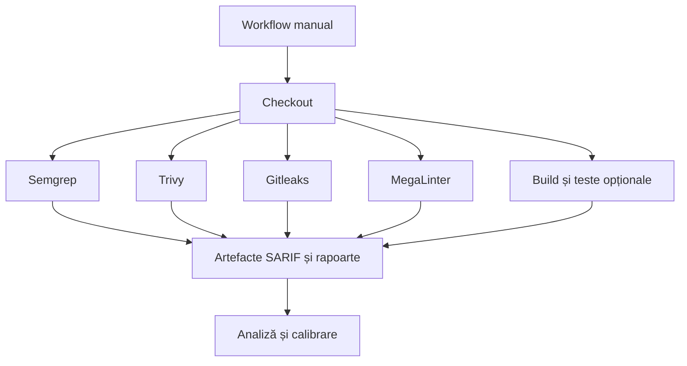

# Ghid complet de implementare DevSecOps CI

## 1. Obiectiv și domeniu

Platforma introduce controale repetabile asupra codului sursă fără transmiterea
obligatorie a codului către servicii SaaS. Acoperă code quality, SAST, secrete,
dependențe, imagini/container/IaC, SBOM și licențe. Implementarea inițială rulează
manual și nu modifică regulile de protecție ale ramurilor.

## 2. Arhitectură



SonarQube este un serviciu central separat. Scannerul poate fi activat prin input
numai după configurarea secretelor `SONAR_HOST_URL` și `SONAR_TOKEN`.

## 3. Mod de execuție pilot

- trigger unic: `workflow_dispatch`;
- `permissions: contents: read`;
- fără `pull_request`, `push`, `schedule` sau deployment;
- fără actualizarea Branch Protection;
- fiecare scanner continuă suficient pentru a produce raportul;
- jobul `summary` afișează clar rezultatele disponibile;
- artefactele nu conțin `.env`, chei sau cod împachetat integral.

Un workflow manual poate apărea roșu când sunt constatate probleme. Acest lucru nu
blochează dezvoltarea deoarece verificarea nu este cerută de Branch Protection.

## 4. Instalarea SonarQube

### Cerințe minime pentru pilot

- Linux x86_64;
- Docker Engine și Compose v2;
- minimum 4 vCPU, 8 GiB RAM și 20 GiB spațiu;
- DNS și TLS prin reverse proxy pentru utilizare organizațională;
- backup separat pentru PostgreSQL și volumele SonarQube.

### Pași

```bash
cd devsecops-ci/platform/sonarqube
cp .env.example .env
# modificați toate valorile CHANGE_ME
docker compose config
docker compose up -d
docker compose ps
```

Nu expuneți PostgreSQL. Portul SonarQube este legat implicit de loopback; publicați-l
prin reverse proxy cu TLS. După prima autentificare schimbați parola administratorului,
creați câte un proiect/token și păstrați tokenurile exclusiv în GitHub Actions Secrets.

### Backup

Opriți aplicația în fereastra de backup, salvați baza PostgreSQL prin `pg_dump` și
volumele `sonarqube_data`, `sonarqube_extensions`, `sonarqube_logs`. Testați restaurarea
trimestrial într-un mediu izolat. Nu considerați copierea volumelor unei baze active
drept backup consistent.

## 5. Secrete GitHub

| Secret/variable | Necesitate | Utilizare |
|---|---:|---|
| `SONAR_HOST_URL` | doar Sonar | URL HTTPS accesibil runnerului |
| `SONAR_TOKEN` | doar Sonar | token proiect, fără drepturi administrative |

Workflow-ul de bază nu are nevoie de PAT. `GITHUB_TOKEN` rămâne read-only. Pentru
servere interne, scannerul SonarQube trebuie executat pe un runner self-hosted aprobat;
runnerul GitHub-hosted nu poate accesa o adresă privată.

## 6. Controale și praguri pilot

| Control | Pilot | Prag propus după calibrare |
|---|---|---|
| Semgrep | raportare | blocare la `ERROR` confirmat |
| Trivy CVE | raportare HIGH/CRITICAL | CRITICAL; HIGH cu excepție aprobată |
| Trivy misconfig | raportare | HIGH/CRITICAL |
| Gitleaks | raportare imediată | orice secret valid |
| MegaLinter | raportare | erori pe fișiere noi/modificate |
| Coverage | colectare unde există | 80% cod nou, prag stabilit per proiect |
| Licențe | inventar/SBOM | denylist aprobat juridic |
| SonarQube | baseline main/manual | Quality Gate pe cod nou când PR support există |

Nu activați simultan toate blocările. Rulați minimum 2–4 săptămâni în mod manual,
clasificați constatările și creați baseline/excepții cu proprietar și expirare.

## 7. Flux operațional

1. Operatorul selectează ramura și pornește workflow-ul.
2. Introduce `scan_depth=standard` sau `extended`.
3. Verifică Summary și descarcă artefactele.
4. Clasifică fiecare constatare: validă, fals pozitiv, risc acceptat, remediată.
5. Pentru risc acceptat înregistrează justificare, proprietar și dată de expirare.
6. Reexecută auditul după remediere.
7. Păstrează raportul relevant ca dovadă de release.

## 8. SBOM și licențe

Trivy produce CycloneDX pentru inventarul inițial. Pentru control juridic complet,
folosiți OSS Review Toolkit (ORT) într-un job separat: Analyzer → Scanner → Advisor →
Evaluator → Reporter. Politica de licențe trebuie aprobată juridic; exemplele din repo
nu constituie decizie juridică. Categorii recomandate: allow, review, deny și unknown.

## 9. Reviewdog și PR-Agent

Acestea sunt faza 2. Reviewdog publică rezultatele linters pe diff și necesită
permisiuni de scriere pentru Pull Requests. PR-Agent poate folosi Ollama local, dar
review-ul AI este consultativ și nu trebuie să fie singurul criteriu de blocare.
Activarea lor necesită threat model pentru prompt injection și limitarea permisiunilor.

## 10. Rollback

Rollback-ul pilotului constă în dezactivarea sau ștergerea workflow-ului separat.
Nu există modificări în build/deploy și nici în Branch Protection. Pentru SonarQube,
opriți stackul fără `-v`; eliminarea volumelor este distructivă și nu face parte din
rollbackul normal.

## 11. Criterii de acceptare pilot

- workflow vizibil numai cu pornire manuală;
- niciun workflow existent nu este modificat;
- scanerele produc artefacte chiar când găsesc probleme;
- permisiunile implicite sunt read-only;
- SonarQube este dezactivat dacă secretele nu sunt configurate;
- nicio adresă, parolă sau cheie reală nu este versionată;
- documentația explică operarea, excepțiile și rollbackul;
- YAML și shell trec validarea sintactică.

